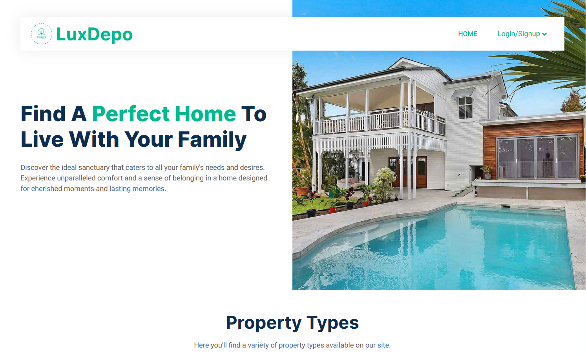

# LuxDepo


## PROJECT

LuxDepo is an ecommerce website application.

### CMS

The project has an active admin panel which is accessible via `admin/`.
All CRUD operations can be performed there.

## TECHNOLOGY

- The project is based on `Python v3.12.4`, `Django v4.2.5` with `Django Rest Framework (DRF) v3.14.0`.
- For data storage, the project utilizes `Postgres v15.4`.

## DEVELOPMENT

### Local installation

1. Create and fill the `.env` configuration file with your postgres database credentials and django SECRET\_KEY.
   You can generate a SECRET_KEY using the following command:
   ```sh
   python -c 'from django.core.management.utils import get_random_secret_key; print(get_random_secret_key())'```
   ```
Example `.env` file:

    SECRET_KEY=your_secret_key
    DB_NAME=your_db_name
    DB_USER=your_db_user
    DB_PASSWORD=your_db_password
    DB_HOST=your_db_host

2. Create and activate a virtual environment.

    ```sh
    python -m venv venv
    .\venv\Scripts\activate
    ```

3. Install requirements.

    ```sh
    pip install -r requirements.txt
    ```

4. Make migrations.

    ```sh
    python manage.py makemigrations
    ```

5. Migrate migration files.

    ```sh
    python manage.py migrate
    ```

6. Create a superuser for the admin panel.

    ```sh
    python manage.py createsuperuser
    ```

7. Run the Django server.

    ```sh
    python manage.py runserver
    ```

### TESTING

1. Run the tests.       No tests available yet :( 

    ```sh
    python manage.py test
    ```

## GIT

1. Each new branch should be created from the `main` branch.

2. For the branch naming, start each branch name with the prefix according to the work you intend to do in it:

    - feature/
    - bugfix/

3. For the merge request, target the working branch to the `develop` branch.